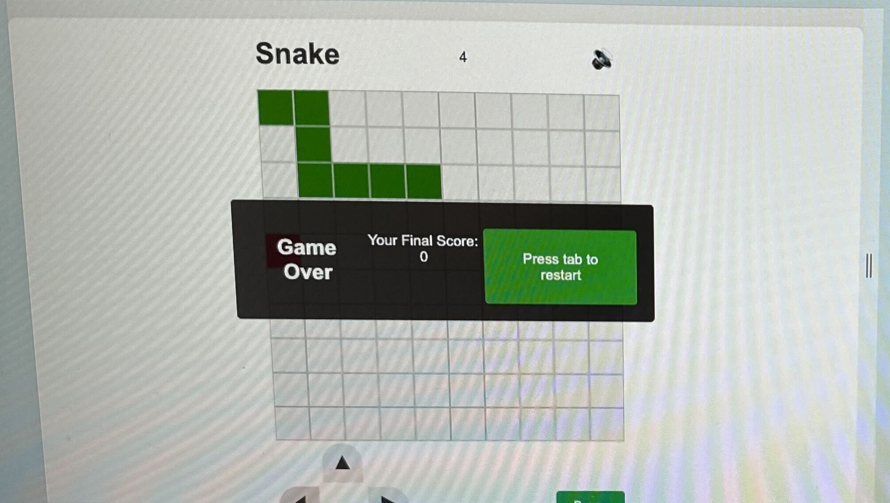
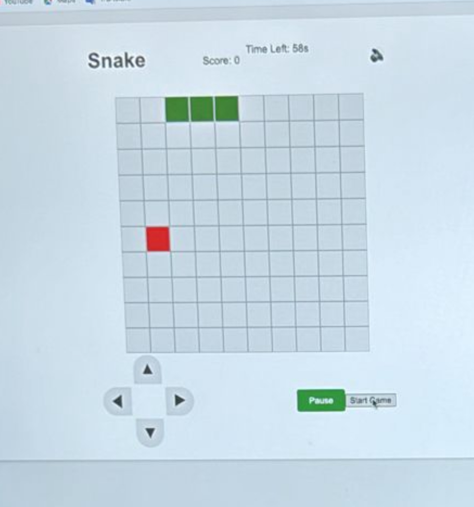

<h1> Snake Game </h1>
<h3> Description  </h3>
This project was completed during the early stages of the course, focusing on building a classic Snake game using HTML, CSS, and JavaScript. It served as an opportunity to practice DOM manipulation, event handling, and game logic implementation.

<h3>Deployment Link</h3>
The deployed version of the Snake Game can be accessed at: https://filom3na.github.io/Project1-Snake/

<h3> Getting Started/Code Installation</h3>
To run the Snake Game locally, follow these steps:

1. Clone the repository: `git clone https://github.com/Filom3na/Project1-Snake.git`
2. Navigate to the project directory: `cd Project1-Snake`
3. Open the `index.html` file in your preferred web browser.

<h3>Timeframe & Working Team</h3>
This project was a solo endeavor, completed within a 4-day timeframe.

**Technologies Used** <br>
- HTML
- CSS
- JavaScript

<h3>Brief</h3>
The brief for this project was to create a browser-based game using HTML, CSS, and JavaScript. The game had to be built with a defined win/lose condition and separate files for HTML, CSS, and JavaScript. Specific requirements included:

- Render a game in the browser
- Use a grid system (no HTML Canvas)
- Design logic for winning and visually display the winner
- Include separate HTML, CSS, and JavaScript files
- Follow KISS (Keep It Simple Stupid) and DRY (Don't Repeat Yourself) principles
- Use JavaScript for DOM manipulation
- Deploy the game online
- Use semantic markup and CSS best practices


### Planning

#### Wireframe

During the planning phase, I created a wireframe to visualise the game's layout and structure. The wireframe included the game board, score display, controls, time left, the music features,an instruction button and a game over/restart screen.

](<images/Screenshot 2024-04-02 at 14.43.56.png>)

#### Pseudocode

Before diving into the code, I wrote pseudocode to outline the game logic and identify the necessary functions and data structures. Here's an example of the pseudocode for the `moveSnake` function:
//? Elements
// gameBoard
// snakeElements -> array -> push and unshift
// foodElement -> 2px bigger
// scoreElement
// timeLeftElement
// gameOverScreen
// restartButton
// pauseButton
// muteButton
// mobileControls (for mobile devices)
// sidePanel (for desktop mode)

//? Variables
// snake (array to store snake's body positions)-> x and y coordinates
// foodPosition --> x and y coordinates -> math.random()
// score
// timeLeft
// gameOver (boolean)
// isPaused (boolean)
// isMuted (boolean)
// direction (object to store current direction)
// level (to track the current level or size)
// snakeSpeed (to store the snake's speed)
// backgroundMusic (audio object for background music)
// eatSound (audio object for eating food sound)
// gameOverSound (audio object for game over sound)

// ?Page Load
// Call setupGameBoard() to create the game board
// Call initialiseSnake() to set the initial snake position
// Call spawnFood() to generate the initial food position
// Call renderSnake() to render the snake on the board
// Call renderFood() to render the food on the board
// Call updateScore() to display the initial score
// Call updateTimeLeft() to display the initial time left
// Call attachEventListeners() to set up event listeners for user input
// Call loadAudioFiles() to load background music and sound effects
// Call showSidePanel() to show the side panel with rules and instructions (for desktop)

//? Functions
// Define setupGameBoard() to create the game board
// Define initialiseSnake() to set the initial snake position
// Define spawnFood() to generate a random food position
// Define renderSnake() to render the snake on the board -> removeSnake() to make it disappear 
// Define renderFood() to render the food on the board on a random position each time -> removeFood()
// Define updateScore() to update and display the score
// Define updateTimeLeft() to update and display the time left
// Define moveSnake() to update the snake's position based on the current direction
// Define handleCollisions() to detect collisions with walls, snake body, and food
// Define updateGameState() to update the game state based on collisions
// Define gameOver() to display the game over screen, play game over sound, and reset the game state

// Define restartGame() to reset the game and start a new game
// Define pauseGame() to pause/resume the game
// Define muteGame() to mute/unmute background music and sound effects
// Define changeSnakeColor() to change the snake's color when eating food
// Define increaseLevel() to increase the level and adjust the snake's speed
// Define attachEventListeners() to set up event listeners for user input
// Define changeDirection() to update the snake's direction based on user input
// Define loadAudioFiles() to load background music and sound effect files
// Define playBackgroundMusic() to play the background music
// Define playSound() to play a sound effect (eating food or game over)
// Define showSidePanel() to show the side panel with rules and instructions (for desktop)
// Define hideSidePanel() to hide the side panel (for mobile)

//? Events
// On arrow key press (for PC) or mobile controls (for mobile devices):
//   Call changeDirection() to update the snake's direction

// On restartButton click:
//   Call restartGame() to reset the game and start a new game

// On pauseButton click:
//   Call pauseGame() to pause/resume the game

// On muteButton click:
//   Call muteGame() to mute/unmute background music and sound effects

// On eating food:
//   Call changeSnakeColor() to change the snake's color
//   Call playSound() to play the eating food sound effect
//   Call increaseLevel() to increase the level and adjust the snake's speed

// On game over:
//   Call playSound() to play the game over sound effect
//   Call gameOver() to display the game over screen and reset the game state

### Build/Code Process

The build process for the Snake Game involved setting up the game board, implementing the game logic, handling user input, and managing various game states.

The build process for the Jungle Snake game involved the following steps:

- Created the game board dynamically using JavaScript by generating grid elements and appending them to the game container.
- Implemented the game logic, including moving the snake, handling collisions, and generating apples.
- Added features like background music, sound effects, muting/unmuting, and a timer functionality that terminates the game when reaching zero.
- Fixed the pause button to ensure the snake and food elements remain visible when pausing and resuming the game.
- Introduced a start game button to allow the player to decide when to begin the game instead of starting automatically.
- Implemented user controls for both keyboard and on-screen buttons to provide a seamless experience across devices.
- Created a responsive layout using CSS media queries to ensure the game is playable on different screen sizes.
- Utilized JavaScript to manipulate the DOM, update game state, and handle user interactions.
- Implemented a side panel to display instructions and used JavaScript to show/hide it based on user actions.


In this section, I've provided a detailed breakdown of the key stages involved in building the Snake Game, along with relevant code snippets and explanations. I've highlighted the game setup, game logic, user input handling, game state management, audio functionality, and instructions panel implementation.

 Here's a breakdown of the key stages and code snippets:
##### Game Setup

The first step was to create the game board and initialize the necessary variables. The `createBoard` function generates the grid elements dynamically, and the `startGame` function sets up the initial game state:

```
function createBoard() {
  for (let i = 0; i < width * width; i++) {
    const square = document.createElement("div");
    square.classList.add("square");
    grid.appendChild(square);
    squares.push(square);
  }
}

function startGame() {
  // Reset game state
  // ...
  generateApple();
  playBackgroundMusic();
  currentSnake.forEach((index) => squares[index].classList.add("snake"));
  // ...
  timerId = setInterval(move, intervalTime);
  timerIntervalId = setInterval(updateTimer, 1000);
}
```
##### Game Logic
The core game logic is handled by the move function, which checks for collisions, updates the snake's position, and handles eating the apple:

```
function move() {
  // Check for collisions
  if (
    // ...
  ) {
    gameOver();
    return;
  }

  // Remove the snake's tail
  const tail = currentSnake.pop();
  squares[tail].classList.remove("snake");

  // Add a new head based on the current direction
  currentSnake.unshift(currentSnake[0] + direction);
  squares[currentSnake[0]].classList.add("snake");

  // Check if the snake ate the apple
  if (squares[currentSnake[0]].classList.contains("apple")) {
    eatApple();
  }
}
```
The eatApple function is responsible for handling the snake eating the apple, updating the score, and increasing the snake's speed:
```
function eatApple() {
  squares[currentSnake[0]].classList.remove("apple");
  currentSnake.push(currentSnake[currentSnake.length - 1]);
  generateApple();
  score++;
  scoreDisplay.textContent = score;
  clearInterval(timerId);
  intervalTime = intervalTime * speed;
  timerId = setInterval(move, intervalTime);

  // Change snake color briefly on eating the apple
  currentSnake.forEach(index => squares[index].classList.add("snake-eat"));
  setTimeout(() => {
    currentSnake.forEach(index => squares[index].classList.remove("snake-eat"));
  }, 300);

  playSound(eatSound);
}
```
##### User Input and Game State Management
The control function handles user input from the keyboard and updates the snake's direction accordingly:
```
function control(event) {
  if (event.keyCode === 39 && direction !== -1) {
    direction = 1; // Right
  } else if (event.keyCode === 38 && direction !== width) {
    direction = -width; // Up
  } else if (event.keyCode === 37 && direction !== 1) {
    direction = -1; // Left
  } else if (event.keyCode === 40 && direction !== -width) {
    direction = +width; // Down
  }
}
```

The pauseGame function allows the user to pause and resume the game:
```
function pauseGame() {
  if (timerId) {
    clearInterval(timerId);
    clearInterval(timerIntervalId);
    timerId = null;
    timerIntervalId = null;
    pauseButton.textContent = "Resume";
  } else {
    timerId = setInterval(move, intervalTime);
    timerIntervalId = setInterval(updateTimer, 1000);
    pauseButton.textContent = "Pause";
  }
}
```

##### Audio and Instructions
The loadAudioFiles function loads the audio files for background music and sound effects, while the playBackgroundMusic and playSound functions handle playing the audio based on the mute state:
```
function loadAudioFiles() {
  backgroundMusic = new Audio('audio/background.wav');
  backgroundMusic.loop = true;
  eatSound = new Audio("audio/eating.mp3");
  gameOverSound = new Audio("audio/gameover.wav");
}

function playBackgroundMusic() {
  if (!isMuted) {
    backgroundMusic.play();
  }
}

function playSound(sound) {
  if (!isMuted) {
    sound.play();
  }
}
```
The code also includes functionality to show and hide the instructions panel:
```
const showInstructionsBtn = document.getElementById('show-instructions-btn');
const sidePanel = document.getElementById('side-panel');
const closeInstructionsBtn = document.getElementById('close-instructions-btn');

showInstructionsBtn.addEventListener('click', () => {
  sidePanel.classList.remove('hidden');
});

closeInstructionsBtn.addEventListener('click', () => {
  sidePanel.classList.add('hidden');
});

window.addEventListener('click', (e) => {
  if (e.target !== sidePanel && !sidePanel.contains(e.target) && e.target !== showInstructionsBtn) {
    sidePanel.classList.add('hidden');
  }
});
```
Throughout the development process, I aimed to write modular and reusable code by separating concerns into different functions. This approach made the codebase more maintainable and easier to understand.

### Features

The Snake Game includes the following features:

- Loading and playing background music and sound effects
- Muting/unmuting the game
- Creating the game board
- Starting a new game with a dedicated start button
- Moving the snake
- Handling collisions and game over
- Eating apples and increasing the score
- Changing the snake's color briefly when eating an apple
- Updating the timer
- Pausing and resuming the game
- Restarting the game after game over
- Showing and hiding the instructions panel
- Handling user input from keyboard and mobile controls
- Increasing the snake's speed as the game progresses


### Challenges

During the development of the Jungle Snake game, the following challenges were encountered:

- Ensuring the snake's movement was smooth and responsive, especially when changing directions.
- Handling collisions accurately, both with the walls and the snake's own body.
- Implementing the timer functionality and synchronizing it with the game state.
- Making the game responsive and adapting the layout for different screen sizes, particularly for mobile devices.
- Integrating audio files and managing the mute/unmute functionality seamlessly.

### Wins

The Jungle Snake game achieved the following wins:

- Successfully implemented the core gameplay mechanics, including snake movement, apple generation, and collision detection.
- Fixed the pause functionality to ensure a seamless gaming experience.
- Introduced a start game button to give players control over when to begin the game
- Added engaging visual effects, such as changing the snake's color when eating an apple and animating the apple's appearance.
- Created a visually appealing and immersive game environment with a jungle theme and background music.
- Implemented a responsive design that allows the game to be played on both desktop and mobile devices.
- Added features like a popup panel for instructions, mute/unmute functionality, and a timer to enhance the user experience.

###### this is the game on day 2 of the project:

as it can be observed the game board is pretty basic, there is a grid, a snake, the food element, header, score number, the volume icon which at that point was not working yet, the arrow keys at the bottom of the screen and a non-functioning pause button.
you can also notice the game over popup, which should have displayed the updated score on the board and the restart button, which was not previously working.


I have then managed to add a timer which would terminate the game when reaching 0 (but at this point it would still not working) I have then fixed the pause button to operate in a way that when paused and resumed the snake element and the food element would still show, and lastly added a start game button to help you decide when to start the game not automatically each time the page is refreshed.

this is the game at the end of the project:
this is the game once terminated 

this is when game over as you can see the snake changes color to black, timer has changed, game has been muted and restart game is functioning to help player restart the game

this is the snake changing color when eating the apple and score getting updated

lastly, this is the game paused and the instructions board open, once pressed Close the tab will be closed. 

In this last picture, this is the game in responsive design, some minor improvements still need to be made

### Key Learnings/Takeaways

During the development of the Jungle Snake game, the following key learnings and takeaways were noted:

- Gained a deeper understanding of JavaScript and DOM manipulation techniques.
- Learned how to structure and organize code for a game project, separating concerns and maintaining readability.
- Improved skills in handling user interactions and implementing game logic.
- Gained experience in creating responsive designs and adapting layouts for different screen sizes.
- Learned how to integrate audio files and manage audio playback in a web game.

### Bugs
At the moment of creating the responsive design, the consideration for different phone sizes was limited to @media (max-width: 600px). As a result, when the game is opened on smaller screens, the layout may appear a bit crowded, but it still works.

### Future Improvements
The following improvements can be considered for future updates of the Jungle Snake game:

- Implement different levels of difficulty with additional obstacles.
- Add a leaderboard to keep track of high scores and encourage competition.
- Enhance the visual effects and animations to create a more immersive experience.
- Optimize the game's performance and loading times, especially for mobile devices.
- Implement touch controls for mobile devices to improve the user experience on touchscreens.
- Improve the responsive design to accommodate a wider range of screen sizes and ensure a better layout on smaller devices.